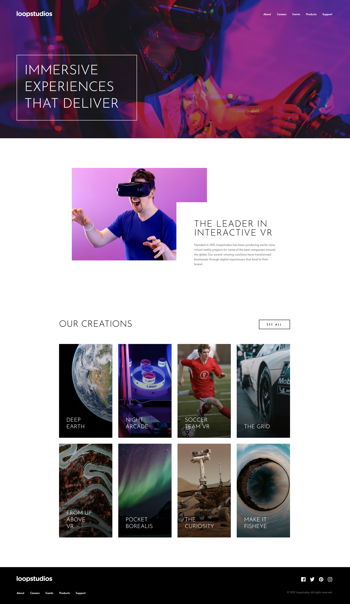

# 🏝️ Proyecto: Loopstudios Landing Page

Este proyecto consiste en el desarrollo de la **landing page de Loopstudios** utilizando **Astro** y **Tailwind CSS**.  
El objetivo es aplicar los conocimientos sobre **componentes de Astro**, **maquetación**, **estilos responsivos** y **utilidades CSS** para construir un diseño limpio, moderno y adaptable a diferentes dispositivos.

---

## 📖 Descripción general

### 🧩 Vista previa del proyecto
Captura de pantalla del resultado final de la landing page.  



---

### 🔗 Enlaces del proyecto

- **Repositorio en GitHub:** [https://github.com/DiegoNatanael/Loopstudios-Landing-Page](https://github.com/DiegoNatanael/Loopstudios-Landing-Page)
- **Sitio desplegado:** [https://diegonatanael.github.io/Loopstudios-Landing-Page/](https://diegonatanael.github.io/Loopstudios-Landing-Page/)

---

## 🧠 Proceso de desarrollo

### 🛠️ Tecnologías utilizadas

- [Astro](https://astro.build) (v6.0.4)
- [Tailwind CSS](https://tailwindcss.com/) (v4.2.1)
- HTML5 semántico
- Diseño responsivo (Mobile-first)
- Componentes de Astro reutilizables
- JavaScript para la lógica del menú móvil

---

### 💡 Lo que aprendí
Durante el desarrollo de este proyecto, reforcé el uso de componentes dinámicos en Astro y la gestión de estados simples con JavaScript nativo para la interactividad del menú.

Ejemplo de la lógica para el menú de móvil:
```js
const menuBtn = document.getElementById('menu-btn');
const mobileMenu = document.getElementById('mobile-menu');

menuBtn?.addEventListener('click', () => {
  mobileMenu?.classList.toggle('hidden');
  document.body.classList.toggle('overflow-hidden');
});
```

También trabajé con el sistema de cuadrícula y Flexbox de Tailwind:
```html
<div class="grid grid-cols-1 md:grid-cols-4 gap-6">
  {creations.map((item) => (
    <div class="relative group cursor-pointer overflow-hidden">
      <!-- Contenido de la creación -->
    </div>
  ))}
</div>
```

---

### 🚀 Áreas de mejora

- Implementar animaciones de entrada (Scroll reveal) para una experiencia más fluida.
- Optimizar aún más el rendimiento de las imágenes utilizando el componente `<Image />` de Astro.
- Explorar el uso de variables personalizadas en la nueva versión de Tailwind CSS 4.

---

### 📚 Recursos útiles

- [Documentación de Astro](https://docs.astro.build)  
- [Guía oficial de Tailwind CSS](https://tailwindcss.com/docs)  
- [Google Fonts - Alata & Josefin Sans](https://fonts.google.com/)

---

### 👩‍💻 Autor

- **Nombre completo:** Diego Natanael Gonzalez Esparza
- **Carrera:** TICS
- **Grupo:** 6to
- **Correo institucional:** 23151206@aguascalientes.tecnm.mx

---

### ✨ Reflexión final

Este proyecto fue una excelente oportunidad para practicar la conversión de un diseño estático a una aplicación web funcional y responsiva. Lo que más disfruté fue trabajar con la arquitectura de componentes de Astro, ya que facilita mucho la organización del código.
